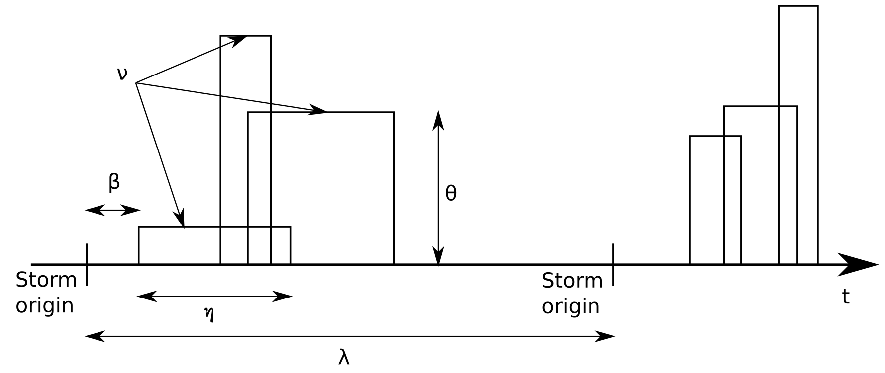

# The Neyman-Scott Rectangular Pulses Model

## Statistical properties of the rainfall model

The rainfall model used in this library is an extension of the model known as the Neyman-Scott Rectangular Pulse Model (NSRPM) and allows the superposition of several independent point processes [1, 2, 3].

The origin of the storms follows a Poisson process with parameter &lambda;.  Associated with each storm there is a random number of rain cells &upsilon; that present a delay with respect to the origin of the storm that follows an exponential distribution of parameter &beta;. The duration and intensity of each rain cell also follow an exponential distribution with parameters &epsilon; and &chi; (scale parameters), respectively. The intensity of each rain cell is constant for as long as it remains active. The intensity of rain at any instant is made up of the sum of the intensities of the active cells at that same instant of time. The duration, intensity and waiting time between a storm and each rain cell are assumed to be independent [4]. A scheme of the model is shown in the follosing figure.

The version of the NSRPM model implemented in this repository can include a maximum of two independent superposed storm generators in order to better adjust to the different types of storms (e.g. convective and frontal rain); which leads us to a model with a maximum of 10 parameters (&lambda;, &upsilon;, &beta;, &epsilon; and &chi; for each type of storm).

The statistical properties of the model were derived from [1, 5, 2, 6].

## Further Developments

The model implemented in this repository will be extended to:

1. work with sub-hourly temporal aggregations.

2. to adjust and simulate the spatial correlation by means of two new parameters (cell radius and storm radius) [3, 2]. It will allow users calibrate and simulate multisite synthetic rainfall series which mimic the observed one.

## References

[1]: Cowpertwait, P.S.P. A generalized spatial-temporal model of rainfall based on a clustered point process
(1995) Proceedings - Royal Society of London, A, 450 (1938), pp. 163-175.

[2]: Leonard, M., Lambert, M.F., Metcalfe, A.V., Cowpertwait, P.S.P. A space-time Neyman-Scott rainfall model with defined storm extent (2008) Water Resources Research, 44 (9), art. no. W09402,.

[3]: Cowpertwait, P., Ocio, D., Collazos, G., De Cos, O., Stocker, C. Regionalised spatiotemporal rainfall and temperature models for flood studies in the Basque Country, Spain (2013) Hydrology and Earth System Sciences, 17 (2), pp. 479-494.

[4]: Cowpertwait, P.S.P. Further developments of the neyman‐scott clustered point process for modeling rainfall
(1991) Water Resources Research, 27 (7), pp. 1431-1438.

[5]: Cowpertwait, P.S.P. A Poisson-cluster model of rainfall: High-order moments and extreme values (1998) Proceedings of the Royal Society A: Mathematical, Physical and Engineering Sciences, 454 (1971), pp. 885-898.

[6]: Rodriguez‐Iturbe, I., Eagleson, P.S. Mathematical models of rainstorm events in space and time
(1987) Water Resources Research, 23 (1), pp. 181-190.
