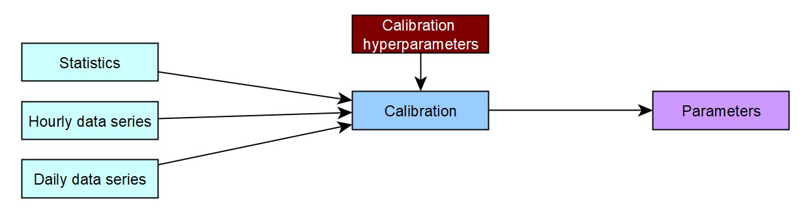
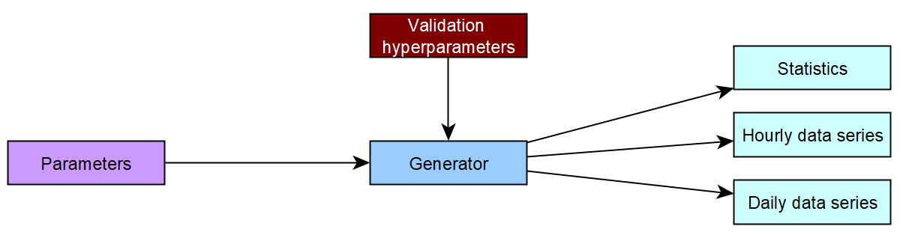

# The NEOPRENE library

## Concept

The **NEOPRENE** library allows to work with Neyman-Scott models for rainfall emulations in an easy way. The library has two main functionalities:

1. **Model Calibration:** Taking daily or hourly time series, or their characteristics statistics, a set of optimal parameters are computed. These parameters allow to reproduce the main statistical properties of the time series, or at least, the provided statistics.

   

2. **Rainfall Generation:** Given a set of parameters, time series at the daily or hourly scale, or their characteristics statistics can be generated.

   

A mathematical description of the model is given in the [linked document](MathematicalDescription.md).

The following sections present the calibraton and validation hyperparameters, as well as some elements that should be considered when using the **NEOPRENE** library.

## Implementation

Currently, the library can only represent rainfall at a given point. The basic model used is represented by the following parameters:

1. Storm arrivals follow a **Poisson** process of parameter &lambda; expressed in storms per square kilometer and per day.
2. Each storm is characterized by a number of cells that follow a **Poisson** process of parameter &upsilon; expressed in storm cells per storm.
3. Each storm cell is characterized by three variables:
   1. The cell lag from the storm origin that follows an **Exponential** process of parameter &beta; measured in hours^-1.
   2. The cell duration that follows an **Exponential** process of parameter &epsilon; measured in hours^-1
   3. The cell rainfall intensity that follow an **Exponential** process of parameter &chi; measured in hours per milimeter.

## Calibration hyperparameters
The calibration parameters are entered in the yml file. The configuration of each of the parameters that need to be filled in the yml file, in the example you can see how it is configured [Input_Cal_Ason.yml](https://github.com/IHCantabria/NEOPRENE/blob/main/notebooks/Input_Cal_Ason.yml). The configuration of each of the parameters that need to be filled in the yml file is explained below. 

+ **Data:** Pandas ```DataFrame``` that contains the original time series that is to be emulated using **NEOPRENE**.

+ **Seasonality: **  Python ```list``` that configures the desired seasonality for the model. Calibration can be done in a monthly basis, by season or by year. In the calibration hyperparameters file the seasonality type is defined within the Seasonality_type field. This can be annual, seasonal, montly or user_defined. If the seasonality is user_defined it is necessary to enter in the Seasonality_user field the seasonality of the user's choice.
  + _annual_: The library assumes that a single set of parameters is able to capture the dynamics for the whole year.
  + _seasonal_: The library merges the different months into the prescribed groups, fitting a different set of parameters per group.
  + _monthly_: The library fits a different set of parameters for each month of the time series.
  + _user_defined_: The user can define a seasonality different from the previous groups.
  
+ **Seasonality_user: ** if the seasonality is set to _user_defined, the desired seasonality must be defined in this section.
    ```python
    ['(1, 2, 3, 4, 5, 6)','(7, 8, 9, 10, 11, 12)']
    ```
+ **temporal_resolution:** ```string``` specifying the temporal resolution of the time series provided to the calibration process.

    ```python
    temporal_resolution = 'h' # Hourly resolution
    temporal_resolution = 'd' # Daily resolution
    ```

+ **process**: ```string``` configuring the model type.

  ```python
  process = 'normal' # Only one type of storm is considered
  process = 'storms' # Convective and Frontal storm are considered
  ```

+ **statistics_name:** ```list``` of ```strings``` that contain the statistics that have to be considered during the fitting process. The statistics included are:

   ```python
   statistics = ['mean', # Rainfall average
                'var_h', # Variance
                'autocorr_l_h', # Autocorrelation
                'fih_h', # Probability of no rainfall
                'fiWW_h', # Transition probability from rainy period to rainy period
                'fiDD_h', # Transition probability from dry period to dry period
                'M3_h'] # Skewness
   ```

   Statistics may refer to different lags (```l```) and aggregation levels (```h```), where the aggregation levels indicate the number of temporal resolutions over which the value is aggregated.

+ **weights:** ```list``` that contains the weights for computing the total error during the calibration process

  ```python
  weights = [100, 1, 1, 1, 1, 1, 1]
  ```

+ **number_iterations:** ```integer``` to define the maximum number of iterations of the calibration process

    ```python
    number_iterations = 20
    ```

+ **number_bees:** ```integer``` defining the number of particles to be used by the calibration algorithm. Calibration is carried out by means of a Particle Swarm Optimization (PSO) algorithm.

  ```python
  number_bees = 10000
  ```
  
+ **number_initializations:**```integer``` defining the number of initializations to be performed during the calibration procedure.

   ```python
  number_initializations = 1
  ```

+ **time_between_storms:** ```list``` defining the range of inter-storm arrival times. The inter-storm arrival time is the inverse of the &lambda; parameter.

  ```python
  time_between_storms = [20, 1000] # hours
  ```

+ **number_storm_cells:** ```list``` defining the range of possible values for the number of storm cells per storm (&upsilon;)

  ```python
  number_storm_cells = [1, 100] # number of cells per storm
  ```

+ **cell_duration:** ```list``` defining the range of possible storm duration values. It is the inverse of the &epsilon; parameter.

  ```python
  cell_duration = [0.15, 5] # hours
  ```

+ **cell_intensity:** ```list``` defining the range of intensities of each storm cell. It is the inverse of the &chi; parameter.

  ```python
  cell_intensity = [0.5, 2000] # mm / hour 
  ```

+ **storm_cell_displacement:** ```list``` defining the range of acceptable lags between the storm origin and each storm cell. It is the inverse of the &beta; parameter.

  ```python
  storm_cell_displacement = [1.01, 50] # hours
  ```
  
If you are using Python code for calibrate the STNSRPM (Space-Time Neyman-Scott Rectangular Pulse Model) and simulate multi-site rainfall series is being used, the calibration parameters that need to be configured are as follows:

+ **coordinates:** ```strings``` defining the type of coordinates to which the location of the stations is referenced. It can be in **geographical** or **UTM** coordinates.

  ```python
  coordinates: 'geographical' #geographical/UTM
  ```
  
+ **storm_radius:** ```True or False``` when the process is True, the storm radius is included. In that case it uses the following parameter **storm_radius_p**, otherwise it is not used.
  ```python
  storm_radius: False
  ```

+ **cell_radius:** ```list``` defiining the range of the cell radius (km).
  ```python
  cell_radius: [0.5, 10] #50, 100 limits depend on the coordinates type (geographical or UTM). Note that  1/cell_radius units are in km. Divide cell_radius per 100 if coordinates are in UTM.
  ```

+ **storm_radius_p:** ```list``` defiining the range of storm radius (km).
  ```python
  storm_radius_p: [10, 40] #100, 5000limits depend on the coordinates type (geographical or UTM). Note that 1/storm_radius_p units are in km. Divide storm_radius_p per 100 if coordinates are in UTM.
  ```

## Simulation hyperparameters


+ **Seasonality_type:** Python ```list``` tAllows to calculate the statistics defined after the simulation has been performed. In the calibration hyperparameters file the seasonality type is defined within the ```Seasonality_type``` field. This can be **annual, seasonal, montly or user_defined**. If the seasonality is ```user_defined``` it is necessary to enter in the ```Seasonality_user``` field the seasonality of the user's choice.

  + _Anual calibraton_: The library assumes that a single set of parameters is able to capture the dynamics for the whole year.
  + _Seasonal calibraton_: The library merges the different months into the prescribed groups, fitting a different set of parameters per group.
  + _Monthly calibration_: The library fits a different set of parameters for each month of the time series.
  + _Seasonality_user_: The user can define a seasonality different from the previous groups.
  
+ **Seasonality_user: ** if the seasonality is set to _user_defined, the desired seasonality must be defined in this section.
    ```python
    ['(1, 2, 3, 4, 5, 6)','(7, 8, 9, 10, 11, 12)']
    ```

+ **statistics_name:** ```list``` of ```strings``` that contain the statistics that have to be considered during the fitting process. The statistics included are:

   ```python
   statistics = ['mean', # Rainfall average
                'var_h', # Variance
                'autocorr_l_h', # Autocorrelation
                'fih_h', # Probability of no rainfall
                'fiWW_h', # Transition probability from rainy period to rainy period
                'fiDD_h', # Transition probability from dry period to dry period
                'M3_h'] # Skewness
   ```

   Statistics may refer to different lags (```l```) and aggregation levels (```h```), where the aggregation levels indicate the number of temporal resolutions over which the value is aggregated.
   

+ **temporal_resolution:** ```string``` specifying the temporal resolution of the time series provided to the calibration process.

   ```python
   temporal_resolution = 'h' # Hourly resolution
   temporal_resolution = 'd' # Daily resolution
   ```
+ **process**: ```string``` configuring the model type.

  ```python
  process = 'normal' # Only one type of storm is considered
  process = 'storms' # Convective and Frontal storm are considered
  ```
  
+ **coordinates:** ```strings``` defining the type of coordinates to which the location of the stations is referenced. It can be in **geographical** or **UTM** coordinates.

  ```python
  coordinates: 'geographical' #geographical/UTM
  ```

+ **storm_radius_p:** ```list``` defiining the range of storm radius (km).
  ```python
  storm_radius_p: [10, 40] #100, 5000limits depend on the coordinates type (geographical or UTM). Note that 1/storm_radius_p units are in km. Divide storm_radius_p per 100 if coordinates are in UTM.
  ```
  
+ **year_ini and year_fin:** Initial and final year of the simulated time series

   ```python
   year_ini = 2000
   year_fin = 2100
   ```